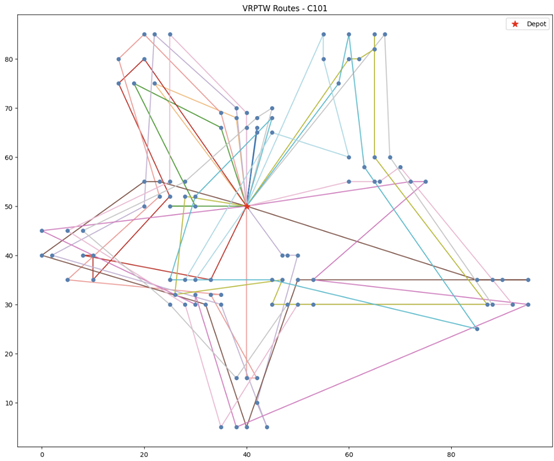

# VRPTW Solver - C101

## Problem Description
Vehicle Routing Problem with Time Windows (VRPTW):
Minimize total travel distance while routing multiple vehicles from a depot to serve all customers within their time windows, then return to the depot.

## Dataset
Solomon Benchmark C101
https://www.sintef.no/projectweb/top/vrptw/100-customers/
- Customers: 100
- Vehicles: 25, capacity 200 each

## Method
Solved using Google OR-Tools:
1. Parse C101.txt data
2. Compute Euclidean distance matrix
3. Build model with capacity and time window constraints
4. Initial solution: PATH_CHEAPEST_ARC + improvement: GUIDED_LOCAL_SEARCH

## Requirements
\```
pip install ortools matplotlib numpy
\```

## Usage
Run all cells in order in Jupyter Notebook.
Make sure `c101.txt` and `VRPTW.ipynb` are in the same directory.

## Results
- Vehicles used: 14
- Total distance: 2362



## Comparison with Best Known Solution
| Metric | This Project | Best Known |
|--------|-------------|------------|
| Vehicles | 14 | 10 |
| Total Distance | 2362 | 828.94 |

## Analysis
Gap reasons:
- Integer truncation in distance matrix reduces precision
- Search time limited to 30 seconds
- PATH_CHEAPEST_ARC produces a low-quality initial solution


## Update below
## Nearest Neighbor Heuristic (Baseline)
- Vehicles used: 21
- Total distance: 1870.69

### Comparison

| | Nearest Neighbor | OR-Tools (GLS) |
|---|---|---|
| Vehicles Used | 21 | 10 |
| Total Distance | 1870.69 | 828.94 |
| Gap | — | −55% vehicles, −56% distance |

Nearest Neighbor is a greedy baseline: starting from the depot, it repeatedly visits the nearest feasible customer (satisfying time windows and capacity), then dispatches a new vehicle when no feasible customer remains. OR-Tools uses Guided Local Search to optimize both metrics simultaneously, matching the best known solution.


