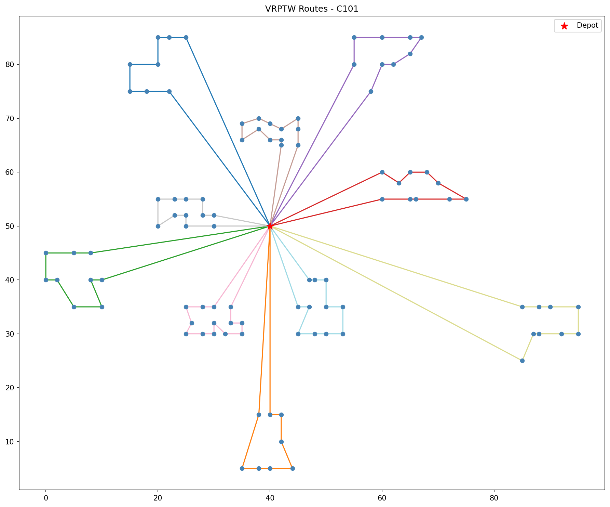
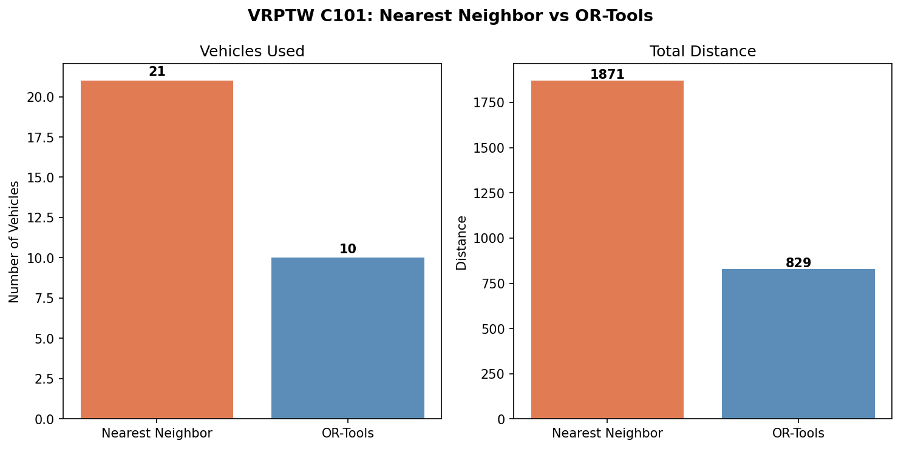

# VRPTW Solver - C101

## Problem Description
Vehicle Routing Problem with Time Windows (VRPTW):
Minimize total travel distance while routing multiple vehicles from a depot to serve all customers within their time windows, then return to the depot.

## Dataset
Solomon Benchmark C101 — https://www.sintef.no/projectweb/top/vrptw/100-customers/
- Customers: 100
- Vehicles: 25 available, capacity 200 each

## Method
Solved using Google OR-Tools:
1. Parse C101.txt data
2. Compute Euclidean distance matrix (float precision)
3. Build model with capacity and time window constraints
4. Initial solution: PATH_CHEAPEST_ARC + improvement: GUIDED_LOCAL_SEARCH

## Requirements
pip install ortools matplotlib numpy

## Usage
Run `VRPTW-float-comparison-with-nn.py` directly: python VRPTW-float-comparison-with-nn.py
Make sure `c101.txt` is in the same directory.

## Results

### OR-Tools (Guided Local Search)
- Vehicles used: 10
- Total distance: 828.94
- Matches the Solomon C101 best known solution exactly

## Comparison: Nearest Neighbor Heuristic vs OR-Tools

Nearest Neighbor is a greedy baseline: starting from the depot, it repeatedly visits the nearest feasible customer (satisfying time windows and capacity), then dispatches a new vehicle when no feasible customer remains. OR-Tools uses Guided Local Search to optimize both metrics simultaneously, matching the best known solution.

| | Nearest Neighbor | OR-Tools (GLS) |
|---|---|---|
| Vehicles Used | 21 | 10 |
| Total Distance | 1870.69 | 828.94 |
| Gap | — | −55% vehicles, −56% distance |

